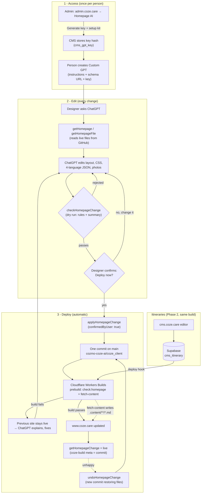

# COZE direct ChatGPT editing

Goal: owner/designer → private ChatGPT (Custom GPT Action) → scoped API on
cms.coze.care → a versioned change → automatic Cloudflare deploy →
www.coze.care. No developer relay and no separate approval: **the person in
the chat confirms the deploy**, and it ships.

### Pipeline



- **Source of truth:** homepage = Git (`HomePageV3.astro`, `src/i18n/pages/home/*.json`,
  `public/home/`); itineraries = Supabase (`.md` files are generated at build).
- **History:** every change is a Git commit plus a `cms_proposal` entry
  (visible at cms.coze.care → Change proposals), attributed to the key's owner.

A commit is **not** proof the site is live; `getHomepageChange` reports that.

## Capabilities

| ChatGPT action | What it can change | History | How it goes live |
| --- | --- | --- | --- |
| `checkHomepageChange` | Nothing (dry run) | — | Validates and returns the summary the designer confirms |
| `applyHomepageChange` | Homepage layout/markup/CSS (`HomePageV3.astro`), homepage copy in all four languages (`src/i18n/pages/home/{en,ko,ja,zh}.json`), images in `public/home/` | One Git commit + a `cms_proposal` entry (kind `homepage_design`) | Commit on the production branch → Cloudflare Workers Builds deploys it |
| `undoHomepageChange` | Restores the files one change touched | New commit + entry; the undone entry is marked closed | Same as above |
| `applyItineraryChange` | One complete itinerary in CMS | `cms_proposal` before (v0) / after (v1) | CMS save requests a Cloudflare build via deploy hook |

The API cannot touch any other file, the cozmo bridge, booking/payment code,
secrets, CMS settings or guest messages.

### What a homepage change is checked for (before it is committed)

Implemented in `lib/homepage-guard.ts`; the same rules run in coze_client's
`scripts/check-homepage.mjs` before every build, so a bad change fails the
build and the previous version stays live.

- Only the five homepage files and `public/home/*.{jpg,png,webp}` (≤ 2 MB,
  ≤ 4000 px, type checked from the file bytes).
- The four copy files keep the same keys and list lengths; `<tags>` and
  `{placeholders}` match English; van prices show the same figures.
- English never moves alone: changing an English string requires changing the
  same string in ko/ja/zh (except strings deliberately identical everywhere).
- Shared copy is frozen: `nav`, `footer`, `legal`, `fab`, `van`, `hosts`,
  `people`, `places`, `experiences`, `journey.steps`, `journey.peopleBody`,
  `journey.aboutAction` (other pages render them).
- `HomePageV3.astro` keeps its frontmatter and `<BaseLayout>`; imports only
  from the site's components/layouts/lib/i18n; no `set:html`, iframes,
  external scripts or stylesheets, `fetch()`, environment variables or
  request-time Astro APIs.
- Stale writes are refused (`expectedCommit` must equal the branch head);
  commits are fast-forward only. At most 10 homepage changes per hour.

### Build status

`getHomepageChange` reads the GitHub check runs Cloudflare posts on the
commit (`queued` → `building` → `failed` | `deployed`) and then the live
page's `<meta name="coze-build">` (added to coze_client's `BaseLayout`) to
report `live`, or `superseded` when a later change containing it is live.

## Personal keys and the setup kit (admin.coze.care → Homepage AI)

Admins open **admin.coze.care → Homepage AI**, type a person's name and
click *Generate key + setup kit*. They get a one-time personal API key and a
ready-to-send message with the steps, name, description, conversation
starters, schema URL (`https://cms.coze.care/gpt-actions-openapi.yaml`, served
from `public/`) and instructions (`lib/gpt-setup-kit.ts`). The person pastes
those into ChatGPT once (Create GPT → Configure → Actions → Import from URL →
API key, Bearer) and can then change and deploy the homepage by chatting.

- Keys are stored as SHA-256 hashes (`cms_gpt_key`, migration `0022`), shown
  once, recorded as the author of every change, and revocable instantly.
- admin.coze.care calls `/api/agent/admin/keys` server-to-server with
  `COZE_ADMIN_PANEL_SECRET` (same value on the CMS and in the admin panel's
  pm2 env). `COZE_GPT_ACTION_TOKEN` remains an optional shared fallback key.

## Activation — not performed by code changes

Each step needs explicit approval.

1. **coze_client:** push the `feat/gpt-homepage` branch (homepage copy moved
   to JSON, `check:homepage` build guard, `coze-build` meta, `public/home/`)
   to `main` of `cozmo-coze-ai/coze_client`. That push deploys through the
   existing Cloudflare Git build, the same path ChatGPT's commits use.
2. **Deploy pipeline:** a push to `main` of `cozmo-coze-ai/coze_client`
   builds and deploys www.coze.care (Cloudflare Workers Builds). Its build
   runs `prebuild`, so `check:homepage` blocks a bad homepage from going live.
3. **GitHub token:** fine-grained token owned by the cozmo@coze.care account,
   repository `cozmo-coze-ai/coze_client` only: Contents read/write, Checks
   read, Commit statuses read, Metadata read.
4. **CMS secrets:** `COZE_GPT_ACTION_TOKEN` (`openssl rand -hex 32`, never in
   prompts or git), `COZE_GPT_ACTION_ACTOR_EMAIL` (an existing CMS editor),
   `COZE_CLIENT_GITHUB_REPO` (default `cozmo-coze-ai/coze_client`), `COZE_CLIENT_GITHUB_TOKEN`,
   `COZE_CLIENT_GITHUB_BRANCH` (default `main`), and — only after step 2 is
   verified — `COZE_CLIENT_CLOUDFLARE_GIT_DEPLOY_ENABLED=true`. Itinerary
   writes additionally need `COZE_CLIENT_CLOUDFLARE_DEPLOY_HOOK_URL`.
5. **Database:** apply migrations `0021_vengeful_callisto.sql` (change
   history) and `0022_gpt_keys.sql` (personal keys) through the approved
   migration process.
6. **Sandbox first:** point `COZE_CLIENT_GITHUB_BRANCH` at a non-production
   branch that Cloudflare builds as a preview, and run the end-to-end checks
   below with the real GPT before switching to the production branch.
7. **Give people access:** admin.coze.care → Homepage AI → generate a key
   per person and send them the setup kit (see above).
8. **Team rule:** developers `git pull` before pushing, since ChatGPT
   commits to the production branch directly.

### End-to-end checks (sandbox, then once in production)

Change a heading in all four languages · attach and swap a photo · a layout
change (move a section) · a rejected edit (English-only change, or a
`legal`/`nav` change) · a stale commit (409) · a deliberately failing build
reported as `failed` · undo. In production: one harmless change, confirm
`live` on www.coze.care, then undo it.

## GPT instructions

```text
You are COZE's homepage editor for www.coze.care. You can change the homepage's
layout, design, text and images, and COZE itineraries. Nothing else.

Homepage:
1. Call getHomepage first. Read every file you will change with getHomepageFile.
2. All visible text lives in the four JSON files (en, ko, ja, zh). Never put
   visible text directly in HomePageV3.astro; add a key to all four files and
   reference it (e.g. t.hero.heading). Translate naturally into Korean,
   Japanese and Simplified Chinese.
3. Change all four languages together, with the same keys and list lengths.
   Never change nav, footer, legal, fab, van, hosts, people, places,
   experiences, journey.steps, journey.peopleBody or journey.aboutAction —
   other pages use them.
4. Prefer small find/replace edits. Put everything for one request into ONE
   change (each deploy rebuilds the site).
5. For photos, ask the user to attach them, pass them as openaiFileIdRefs with
   imageFilenames, and use /home/<name> in the page. Keep meaningful alt text
   in all four languages.
6. Keep the COZE look: warm ivory, deep ink, forest/gold accents, serif
   headings, restrained radii, generous spacing. It must work on phones
   (320–390 px) and desktop.
7. Never invent prices, availability, capacities, reviews, locations or legal
   promises.
8. Before deploying, ALWAYS call checkHomepageChange. If it is rejected,
   read every listed problem, fix them all, and check again. On 409, re-read.
9. When the check passes, show the user a short plain-language summary (what
   text changes, before → after; layout changes; new photos) and ask:
   "Deploy this to www.coze.care now?" Deploy only after an explicit yes, by
   calling applyHomepageChange with the same body and confirmedByUser: true.
   Never set confirmedByUser without that yes.
10. After deploying, poll getHomepageChange. Say it is live only when
   build.state is "live" and share the live URL. If "failed", explain the
   error, fix it, check and confirm again.
11. Offer undo (undoHomepageChange, after the user confirms) whenever the
   user is unhappy.

Itineraries: read with getItinerary first, send the complete content with
expectedUpdatedAt to applyItineraryChange.
```

## Operational caveats

- One shared token cannot identify individual ChatGPT users; every change is
  attributed to `COZE_GPT_ACTION_ACTOR_EMAIL`. Rotate the token when access
  changes. Per-person identity needs OAuth (later).
- Visual problems that still build are possible; undo is one call.
- Every homepage change is a full coze_client build, which fetches CMS content
  and media from Supabase. The hourly limit and batching protect build minutes
  and Supabase egress; keep the `node_modules/.cache` media mirror in
  `fetch-content.mjs`.
